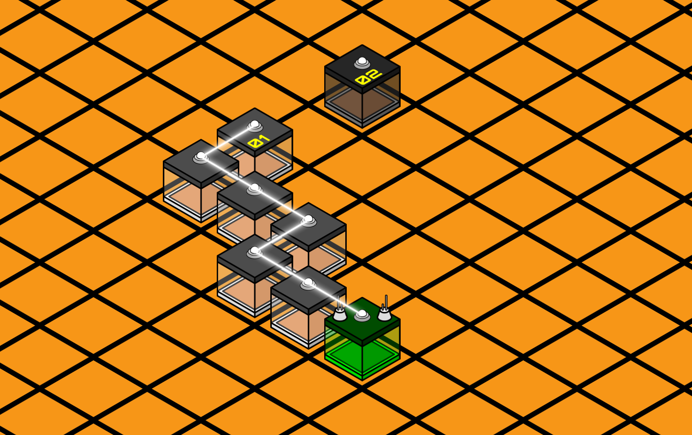
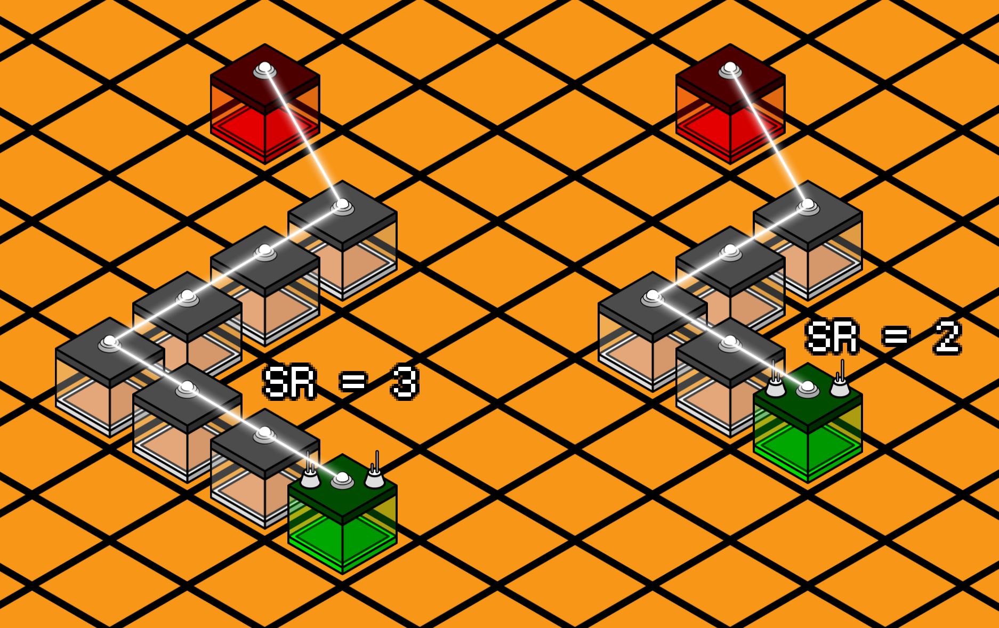
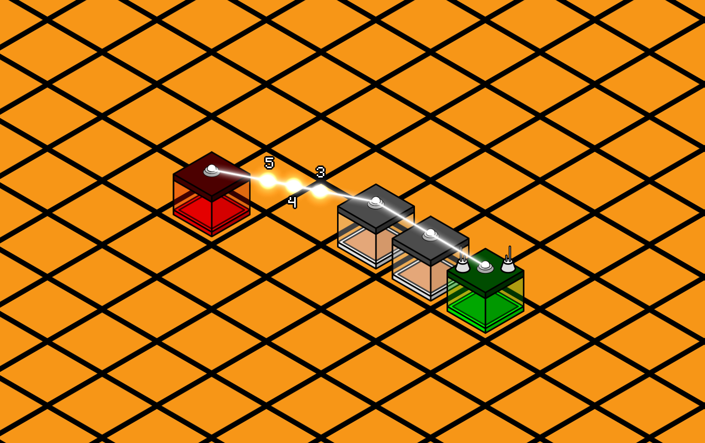

# DatsSol

Пошаговая стратегия, где игроки соревнуются за превращение безжизненной планеты в сеть цветущих оазисов… попутно аккуратно (или не очень) мешая друг другу это сделать.

## Важная информация

1. В документации некоторые ключевые моменты дополнительно подсвечены знаком (!). Рекомендуем не пропускать их, там часто скрываются нюансы, влияющие на стратегию.
2. Если в ходе игры вы обнаружите ошибки, неточности или противоречия в документации — пожалуйста, сообщите об этом в топик поддержки (в сообщении обязательно укажите тег бота @DatsHackathonsBot).
3. Запрещено использование мультиаккаунтов. При подозрении на их использование организаторы оставляют за собой право дисквалифицировать команду без предварительного уведомления.
4. В случае расхождений между документацией и фактическим поведением игры приоритет имеет игровая логика (сервер). Документация может обновляться по мере уточнения механик.
5. Организаторы оставляют за собой право:
   - вносить изменения в баланс и механику игры
   - уточнять правила
   - исправлять критические ошибки

Оповещения о таких изменениях обязательно будут в топике "новости".

## Полезные ссылки

- Статистика - https://gamethon.datsteam.dev/datssol/stats
- Сваггер - https://games-test.datsteam.dev/static/datssol/openapi/

## Карта

Плоскость XY.

### Клетки карты

Каждая координата карты это клетка, которая может быть двух видов:
1. **пустыня** - клетки пригодные для терраформирования.
2. **горы** - клетки, которые нельзя терраформировать.

## Ход

Минимальная единица игрового времени. В течение хода игрок может получить текущее состояние игрового мира и отдать команды своим юнитам. По завершении хода наступает фаза обработки. Длительность хода — 1 секунда (может измениться по итогам тестовых раундов).

## Фаза обработки

Время, в которое сервер обрабатывает команды игроков и меняет состояние мира.

### Порядок действий сервера:

1. Апгрейды плантаций
2. Ремонт/Стройка
3. Диверсии
4. Атака по логову бобров
5. Перенос ЦУ
6. Атака бобров
7. Деградация потерянных плантаций
8. Урон по недостроенным плантациям (когда не было прогресса 1 ход)
9. Терраформация и начисление очков.
10. Респавн игроков
11. Обработка природных катаклизмов

В каждый этап сервер проходит по всем юнитам. Гарантируется, что внутри каждого этапа все юниты совершат свое действие или станут целью действия.
Некоторые юниты могут не дойти до следующего этапа, если в текущем будут уничтожены.

## Раунд

Длится 600 ходов.

В течение раунда игрок развивает свою сеть плантаций и зарабатывает очки.

По завершении раунда:
- весь прогресс развития сбрасывается
- игрок начинает следующий раунд с нуля
- заработанные баллы сохраняются и идут в общий зачёт

Именно сумма баллов за все раунды определяет победителя.

> **(!)** Количество ходов в тестовом раунде может быть изменено, если будет скорректирована длительность хода.

Расписание и параметры финальных раундов будут адаптированы в соответствии с этими изменениями.
Между финальными раундами будет время на технический перерыв.

## Плантации

Контролируемые игроком юниты. Все игроки начинают с одной плантации(ЦУ) расположенной на окраине.

Плантации терраформируют под собой клетки карты, создавая там оазис. В конце каждого хода за прогресс терраформирования начисляются очки.

### Основные характеристики плантации:

| # | Параметр | Описание | По умолчанию |
|---|----------|----------|--------------|
| 1 | HP (health points) | текущие очки здоровья | - |
| 2 | MHP (Max Health Points) | максимальные значение очков здоровья | 50 |
| 3 | TS (terraforming speed) | скорость, с которой плантация преобразует клетку | 5 |
| 4 | CS (Construction Speed) | скорость строительства новой плантации | 5 |
| 5 | RS (Repair Speed) | скорость ремонта плантации | 5 |
| 6 | SE (Sabotage Efficiency) | эффективность диверсии | 5 |
| 7 | BE (Beaver Lair Elimination) | эффективность уничтожения логова бобров | 5 |
| 8 | DS (Degradation Speed) | скорость деградации плантации без управления и незавершенных построек | 10 |
| 9 | AR (action range) | Радиус выполнения команды. Считается от координаты выходной плантации | 2 |
| 10 | SR (signal range) | Радиус дальности выбора выходной плантации для исполнения команды | 3 |
| 11 | VR (vision range) | Радиус обзора плантаций | 3 |

Есть лимит по количеству плантаций - по умолчанию игрок может контролировать **30 плантаций**.

## Центр управления (ЦУ)

Является сердцем всей системы, участвует в координации работы всех плантаций. Как и обычная плантация терраформирует клетку под собой.

> **(!)** Функции ЦУ можно передать любой другой прилегающей плантации. На месте ЦУ остается обычная плантация. При перемещении ЦУ количество HP плантаций не изменяется.

### Уничтожение ЦУ

> **(!)** Если по какой либо причине игрок теряет ЦУ - все плантации игрока разрушаются и он начинает игру заново получив штраф по очкам - 5% от текущих (округление вниз, но не менее чем 1). Текущие апгрейды сохраняются.

### Логистика управления

Можно управлять только теми плантациями, которые по цепочке от ЦУ находятся на смежных клетках (по диагонали не считается).



Зеленая - ЦУ. Можно управлять - 1, нельзя управлять - 2.

### Радиусы AR, SR и VR

> **(!)** Определяется как максимальное допустимое смещение по осям X и Y относительно позиции плантации.

Цель считается доступной, если она находится в пределах радиуса по каждой из координат:
- |ΔX| ≤ R
- |ΔY| ≤ R

где:
- ΔX и ΔY — смещение цели относительно плантации по соответствующим осям
- R — значение радиуса (AR, SR или VR)

Таким образом, зона действия радиуса формирует **квадратную область**, центрированную на плантации.

### Потерянные плантации

> **(!)** Если у плантации теряется связь (цепочка плантаций) с ЦУ, то:
> 1. теряется возможность управлять ею
> 2. она прекращает выполнять ранее отданную команду.
> 3. она продолжает терраформировать клетку, но это не приносит очки.
> 4. постепенно разрушается теряя по HP в ход. Количество потерянных HP зависит от параметра скорости деградации плантации(DS).

Если восстановить связь с ней, то она снова становится полноценной плантацией.
Потерянная плантация учитывается в лимите количества плантаций.

## Функционал плантаций

Каждый ход плантация, в том числе ЦУ, может терраформировать клетку под собой (происходит постоянно, команда на это не нужна) и одновременно выполнять одно из действий на выбор:
1. строить новую плантацию
2. ремонтировать другую свою плантацию
3. проводить диверсию на плантации конкурентов
4. уничтожать логово бобров

Все действия можно выполнять как напрямую из плантации отдающей команду, так и используя как выходную точку любую другую свою плантацию.

> **(!)** Однако есть ограничение - каждая последующая команда проходящая через одну плантацию теряет эффективность скорости стройки, скорости ремонта, эффективности диверсии и урона по логову бобров (CS, RS, SE, BE) уменьшая ее на 1, вплоть до 0.

Нельзя использовать плантацию как выходную точку, если та находится далее чем позволяет дальность сигнала(SR).



Показаны варианты дальности сигнала(SR) равного 3 и 2.



Все последующие команды строительства/ремонта/диверсии/атаки логова бобров выбравшие как выходную точку одну и ту же плантацию теряют эффективность.

## Апгрейд плантаций

Каждые 30 ходов начисляется очко апгрейда. Максимум можно получить 15 очков. Очки можно потратить чтобы усилить все свои плантации выбрав одно усиление из списка:

1. увеличение силы ремонта(RS) на 1. Максимум 3 усилений.
2. увеличение максимального количества HP на 10. Максимум 5 усилений.
3. увеличение лимита поселений на 1. Максимум 10 усилений.
4. увеличение дальности сигнала(SR) на 1.
5. уменьшение скорости деградации(DS) на 2. Максимум 3 усиления. Работает и на стройку.
6. уменьшение урона от землетрясения на 2. Максимум 3 усилений. Работает и на стройку.
7. уменьшение урона от атак бобров на 2. Максимум 5 усилений. Работает и на стройку.
8. увеличение радиуса обзора(VR) на 2. Максимум 5 усилений.

## Основание новой плантации

Каждая плантация может строить новую плантацию на любой клетке в пределах своего радиуса выполнения команд(AR).

В постройке одной новой плантации может участвовать любое количество плантаций (применяется ограничение эффективности).

> **(!)** Стройка/недострой - отдельный тип юнита. На него не распространяется апгрейд максимального количества HP. Скорость постройки определяется соответствующим параметром(CS). Как только HP стройки будет доведено до 50, она превращается в плантацию. С этого момента ею можно управлять и она начинает процесс терраформирования. Количество HP только что построенной плантации определяется значением максимального количества HP (MHP).

> **(!)** Если несколько игроков пытаются построить плантацию на одной клетке, то каждый из них имеет свой прогресс стройки. По итогу на клетке останется та плантация, которая была построена раньше.

Если несколько игроков завершат стройку плантации в один ход, то весь прогресс строительства будет обнулен и им придется начинать строку сначала.

После основания плантации она становится невосприимчивой к действиям конкурентов, природным катаклизмам и атакам бобров на протяжении **3 ходов**.

Нельзя иметь больше плантаций, чем позволяет лимит:
Если начать строить плантацию сверх лимита, то в момент первого прогресса строительства новой плантации с карты исчезнет самая старая. Возраст плантации считается в ходах с момента завершения ее стройки. Если несколько старых плантаций были основаны в один ход, то исчезнет случайная из них.

> **(!)** Осторожно - таким образом можно разрушить ЦУ.

Если у строящейся плантации не было прогресса стройки в течение одного хода, то она начнет деградировать с силой соответствующей скорости деградации плантаций(DS).

## Диверсия на чужой плантации

Каждый ход можно совершать диверсию на чужой плантации тем самым уменьшая её HP на показатель эффективности диверсии(SE) в ход. Если HP довести до 0, то плантация будет разрушена, а диверсант получает столько очков победы, сколько могло быть получено с этой клетки.

> **(!)** Нельзя атаковать строящуюся плантацию, вместо этого происходит стройка своей на той же клетке по правилам описанным в разделе Основание новой плантации.

Текущий прогресс терраформации клетки сохраняется после разрушения плантации.

Если в диверсии участвовало несколько игроков, то очки начисляются тому, кто нанес в последний ход больше всех урона. Если несколько игроков нанесли одинаковое значение - то очки делятся поровну.

## Ремонт плантации

Каждый ход можно ремонтировать свою плантацию восстанавливая ее HP. Количество восстанавливаемых HP в ход зависит от показателя скорости ремонта(RS).

Для выполнения ремонта необходимо выдать соответствующую команду любой другой плантации. Плантация не может ремонтировать саму себя.

## Терраформация клетки

По умолчанию все клетки имеют 0% прогресса терраформации.

Каждая плантация автоматически преобразует клетку, на которой расположена, увеличивая прогресс терраформации на значение параметра TS (terraforming speed) за ход.

Этот процесс происходит постоянно и не требует отдельной команды.

Скорость терраформации измеряется в процентах:
- 100% — клетка полностью терраформирована
- каждый ход плантация добавляет к прогрессу значение своего TS

По завершении каждого хода игрок получает очки, пропорциональные прогрессу, достигнутому в этом ходу:
- **Обычная клетка** приносит максимум **1000 очков**
- **Усиленная клетка** (где X и Y кратны 7) — максимум **1500 очков**

Таким образом, за каждый 1% терраформации начисляется:
- **10 очков** для обычной клетки
- **15 очков** для усиленной

**Пример:**
Плантация с TS = 5 терраформирует обычную клетку:
- за ход прогресс увеличивается на 5%
- игрок получает 50 очков за ход

Та же плантация на усиленной клетке:
- прогресс также +5%
- игрок получает 75 очков за ход

> **(!)** Клетки, у которых координаты X и Y кратны 7, приносят больше очков.

> **(!)** После достижения 100% терраформации клетка считается завершённой, и плантация на ней исчезает.

> **(!)** После полной терраформации клетка не остаётся стабильной навсегда: спустя 80 ходов она начинает терять прогресс со скоростью 10% в ход, постепенно возвращаясь в исходное состояние.

По результатам тестовых раундов время до начала деградации клетки может быть изменено.

## Очки раунда

Терраформация клеток, диверсии на чужих плантациях и уничтожения логова бобров приносят очки. Эти очки участвуют в распределении мест игроков в рамках раунда, за которые будут начисляться баллы, определяющие победителя.

## Логово бобров

Располагаются по всей карте и не любят чужаков.

- За один ход атакуют все плантации разрушая их на **15 HP**. Радиус дальности атак(AR) для логова составляет **2**.
- Атаки затрагивают в том числе и недостроенные плантации.
- Логово имеет **100 HP** и так же каждый ход регенерирует на **5 HP**.
- За уничтожение логова игроки получат **10x очков**, которые могли быть получены с клетки.

Если в уничтожении участвовало несколько игроков, то очки начисляются тому, кто нанес в последний ход больше всех урона. Если несколько игроков нанесли одинаковое значение - то очки делятся поровну.

После уничтожения логова, клетка остается готовой к терраформированию.

## Природные катаклизмы

Время от времени на карте возникают песчаные бури и землетрясения.
Природные катаклизмы не наносят урон бобрам.

### Песчаные бури

Зарождаются в случайной точке карты и движутся по диагонали, пересекая её. Одновременно на карте может существовать только одна буря. Все бури движутся линейно и уменьшают HP плантаций на **2 единицы** за ход. Буря всегда движется через центр карты.

- Вероятность возникновения каждый ход - **10%**.
- Каждой буре необходимо **5 ходов** для того чтобы полностью сформироваться и начать продвижение по карте. Пока буря полностью не сформирована она не наносит урон.

> **(!)** Буря не может уничтожить плантацию, только довести HP до 1.

- Скорость движения бури составляет от **5 до 15** клеток в ход, задается рандомно в момент появления бури.
- Игроки получают по буре информацию по ее текущей координате, скорости, радиусу и ее название.

### Землетрясения

Масштабные события, изменяющие рельеф карты. Мгновенно уменьшают HP всех плантаций и построек на **10 единиц**.

- Вероятность возникновения каждый ход - **5%**.
- Если плантация уничтожена землетрясением, никто не получает очки победы за диверсии, совершённые до её уничтожения.

## Кто победит

Критерии победы в порядке приоритета, в сумме за все финальные раунды:
1. набрать больше всех баллов
2. потерять меньше всех плантаций
3. уничтожить больше всех бобров
4. провести больше всех диверсий

Все показатели считаются в сумме за все финальные раунды.
Критерии 2, 3, 4 вступают в силу по очереди, если несколько игроков набрали равное количество очков в предыдущем пункте.

## Достижения

### Будем соседями
Несколько строителей и ноль результата.
- Условие: вместе с другими игроками одновременно достроить плантацию на одной клетке, приведя к обнулению строительства.
- Доступно в финальном раунде № 1.

### Счастливчик
Не обязательно быть лучшим, чтобы получить приз.
- Условие: занять 77 место.
- Доступно в финальном раунде № 2.

### Спустя рукава
Одной больше, одной меньше…
- Условие: больше всего потерянных плантаций в первом раунде.
- Доступно в финальном раунде № 3.

### Дурак и молния
Грохочет гром, сверкает молния в ночи…
- Условие: кто больше всех получил урона от бури.
- Доступно в финальном раунде № 4.

### Гроза бобров
Видишь бобра? Нет, потому что я первым добрался до него.
- Условие: первым уничтожить логово бобров.
- Доступно в финальном раунде № 5.

## Кто считается активным участником

Команда считается активным участником, если она терраформировала не менее 2 клеток в раунде как минимум в половине финальных раундов.

## Начисление баллов

За победу в раунде команде начисляются баллы в зависимости от занятого места.

Места в раунде определяются по количеству набранных очков. Первое место получает команда(ы), которая наберёт больше всех. На одном месте может быть несколько команд, если они набрали равное количество очков.

Гарантируется минимум 1 балл если в конце раунда команда имеет больше 0 очков.

### Таблица баллов за место

| Место | Баллы | Место | Баллы |
|-------|-------|-------|-------|
| 1 | 150 | 27 | 24 |
| 2 | 114 | 28 | 23 |
| 3 | 89 | 29 | 22 |
| 4 | 69 | 30 | 21 |
| 5 | 58 | 31 | 20 |
| 6 | 50 | 32 | 19 |
| 7 | 44 | 33 | 18 |
| 8 | 43 | 34 | 17 |
| 9 | 42 | 35 | 16 |
| 10 | 41 | 36 | 15 |
| 11 | 40 | 37 | 14 |
| 12 | 39 | 38 | 13 |
| 13 | 38 | 39 | 12 |
| 14 | 37 | 40 | 11 |
| 15 | 36 | 41 | 10 |
| 16 | 35 | 42 | 9 |
| 17 | 34 | 43 | 8 |
| 18 | 33 | 44 | 7 |
| 19 | 32 | 45 | 6 |
| 20 | 31 | 46 | 5 |
| 21 | 30 | 47 | 4 |
| 22 | 29 | 48 | 3 |
| 23 | 28 | 49 | 2 |
| 24 | 27 | 50 | 1 |
| 25 | 26 | 51+ | 1 |
| 26 | 25 | | |

---

## API: описание полей запросов и ответов

### Авторизация
Во все запросы нужно передавать заголовок `X-Auth-Token: <ваш_токен>`.

### Координаты
Координата передаётся как массив из двух чисел: `[x, y]`.

---

### GET /api/arena

**Назначение:** возвращает текущее состояние мира на этот ход.

**Поля ответа:**

- `turnNo` — Номер текущего хода.
- `nextTurnIn` — Через сколько секунд начнётся следующий ход.
- `size` — Размер карты в формате `[width, height]`.
- `actionRange` — Радиус действия плантаций.

#### `plantations[]`
Список ваших плантаций.
- `id` — уникальный идентификатор плантации.
- `position` — координата плантации `[x, y]`.
- `isMain` — `true`, если это ЦУ (главная плантация).
- `isIsolated` — `true`, если плантация изолирована от связанной сети.
- `immunityUntilTurn` — ход, до которого действует иммунитет после респавна/появления.
- `hp` — текущее здоровье плантации.

#### `enemy[]`
Список замеченных вражеских плантаций.
- `id` — идентификатор вражеской плантации.
- `position` — координата `[x, y]`.
- `hp` — текущее здоровье.

#### `mountains`
Список клеток-гор, недоступных для терраформирования и строительства.
Каждая запись — координата `[x, y]`.

#### `cells[]`
Список известных терраформированных клеток.
- `position` — координата клетки `[x, y]`.
- `terraformationProgress` — текущий прогресс терраформации клетки.
- `turnsUntilDegradation` — через сколько ходов начнётся деградация.

#### `construction[]`
Список строящихся плантаций.
- `position` — координата стройки `[x, y]`.
- `progress` — текущий прогресс строительства.

#### `beavers[]`
Список логов бобров.
- `id` — идентификатор цели.
- `position` — координата `[x, y]`.
- `hp` — текущее здоровье.

#### `plantationUpgrades`
Состояние системы апгрейдов.
- `points` — сколько очков апгрейда доступно сейчас.
- `intervalTurns` — раз в сколько ходов начисляется новое очко апгрейда.
- `turnsUntilPoints` — через сколько ходов придёт следующее очко.
- `maxPoints` — максимальный запас очков апгрейда.
- `tiers` — список всех доступных веток улучшений.

#### `plantationUpgrades.tiers[]`
- `name` — кодовое имя апгрейда.
- `current` — текущий уровень.
- `max` — максимальный уровень.

Примеры `name` у апгрейдов:
- `repair_power` — сила ремонта и строительства.
- `max_hp` — максимальное здоровье плантаций.
- `settlement_limit` — лимит плантаций.
- `signal_range` — радиус действия плантаций.
- `vision_range` — радиус обзора.
- `decay_mitigation` — замедление деградации потерянных клеток.
- `earthquake_mitigation` — снижение урона от землетрясений.
- `beaver_damage_mitigation` — снижение урона от бобров.

#### `meteoForecasts[]`
Прогноз катаклизмов. Поле присутствует всегда.
- `kind` — тип события (`earthquake` или `sandstorm`).
- `turnsUntil` — через сколько ходов событие произойдёт.
  - Для землетрясения: `0` означает удар в этом ходу.
  - Для песчаной бури: используется пока буря формируется.
- `id` — идентификатор бури.
- `forming` — `true`, если буря ещё формируется; `false`, если уже движется.
- `position` — текущий центр бури `[x, y]`.
- `nextPosition` — где будет центр бури на следующем шаге.
- `radius` — радиус бури.

---

### POST /api/command

**Назначение:** Отправляет ваши действия на текущий ход.

**Тело запроса:**

#### `command[]`
Массив действий плантаций.
- `path` — маршрут действия, массив координат.

**Формат `path`:**
```json
{
  "command": [
    {
      "path": [
        [x1, y1],
        [x2, y2],
        [x3, y3]
      ]
    }
  ]
}
```

где:
- первая координата - автор команды.
- вторая координата - выходная точка команды. может быть сам автор.
- третья координата - цель команды.

**Практическое пояснение:**
Тип действия определяется конечной целью:
- своя плантация в конце маршрута — **ремонт**
- чужая плантация — **диверсия**
- логово/цель бобров — **атака**
- пустая клетка — **строительство**

#### `plantationUpgrade`
Название апгрейда, который нужно купить в этом ходу.
Пример: `"repair_power"`.

#### `relocateMain`
Маршрут переноса ЦУ. Формат такой же, как у `path`: массив координат.
Минимально: `[[fromX, fromY], [toX, toY]]`

**Важно:** Сервер ожидает, что в ходе будет отправлено хотя бы одно полезное действие: `command`, или `plantationUpgrade`, или `relocateMain`. Иначе — ошибка:
`empty command: no plantation actions, no relocateMain, and no plantationUpgrade provided`

**Пример реального запроса на строительство:**
```json
{
  "command": [
    {
      "path": [
        [396, 303],
        [396, 303],
        [396, 302]
      ]
    },
    {
      "path": [
        [396, 302],
        [396, 303],
        [396, 304]
      ]
    }
  ],
  "plantationUpgrade": "",
  "relocateMain": [
    [396, 301],
    [396, 302]
  ]
}
```

**Пример запроса на апгрейд:**
```json
{
  "plantationUpgrade": "repair_power"
}
```

**Пример успешного ответа:**
```json
{
  "code": 0,
  "errors": []
}
```

**Пример ответа на пустую команду:**
```json
{
  "code": 0,
  "errors": [
    "empty command: no plantation actions, no relocateMain, and no plantationUpgrade provided"
  ]
}
```

Примеры возможных сообщений в `errors`:
- `command already submitted this turn`
- `empty command: no plantation actions, no relocateMain, and no plantationUpgrade provided`

---

### GET /api/logs

**Назначение:** Возвращает игровые логи игрока.

**Ответ:** Массив записей лога.

#### `logs[]`
- `time` — время сообщения.
- `message` — текст сообщения.

Типичные сообщения:
- спавн главной плантации
- применение апгрейда
- урон от землетрясения
- уничтожение плантации
- респавн после уничтожения

Если токен не зарегистрирован:
```json
{
  "code": 3,
  "errors": [
    "you are not registered in the game, please register first"
  ]
}
```
